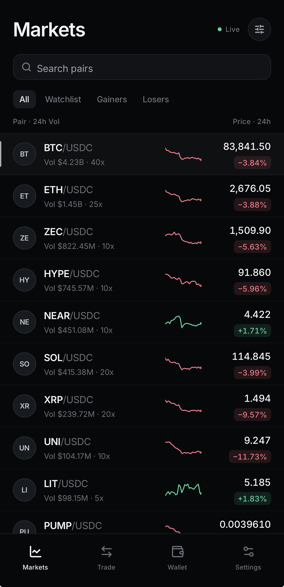
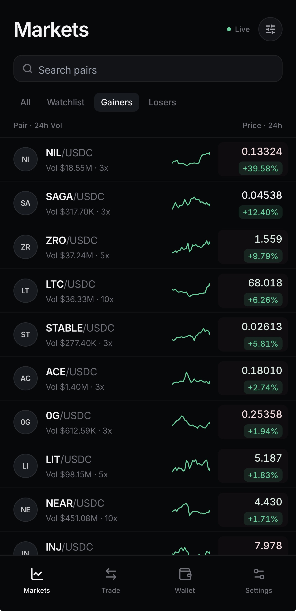
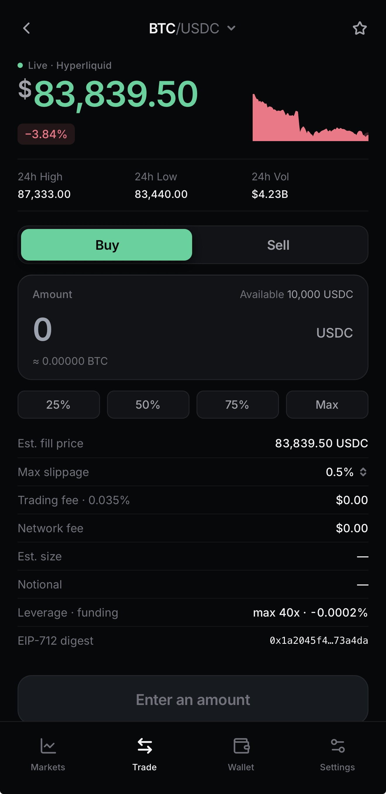

# PerpTerminal (`perp-terminal`)

A small Hyperliquid-flavoured perps client built in Expo + React Native + TypeScript.

## What this is

I have shipped production React/TypeScript crypto UI on the web and React Native, I built this: a tight,
polished spike that takes the parts of mobile trading UI that are actually hard —
high-frequency list updates, gesture-driven charts, wallet auth, optimistic order state —
and implements each one against real APIs, on device primitives, in about a thousand lines
of first-party code. Market data is live Hyperliquid REST and websocket. Signing is real
ed25519 against a real Solana devnet RPC. Orders are simulated and labelled as such in the
UI, because inventing a trading backend would prove nothing. Every integration degrades to
a clearly-marked stub when its key is missing, so a fresh clone runs with an empty `.env`.
The skill → file map below links each skill in the job description to the file where it lives.

## Screenshots

<p align="center">
  
  
  
</p>

## Setup

```bash
git clone <this repo> && cd perp-terminal
bun install
cp .env.example .env     # optional — the app runs fine without it
bun start                # then scan the QR with Expo Go, or press i / a
```

To get every integration live, see [ENV_SETUP.md](ENV_SETUP.md): where each key comes
from and how to check it works.

Scripts: `bun start`, `bun run lint`, `bun run typecheck`, `bun run ios`, `bun run android`,
`bun run doctor`. Uses Bun (`bun.lock`); run Expo CLI as `bunx expo …`.

**Expo Go vs development build.** Markets, the chart, the trade ticket, Solana and Settings
all run in Expo Go — Skia, Reanimated and Gesture Handler are bundled with it. Two things
need a development build (`bunx expo run:ios`, or `bunx eas-cli build --profile development`):

- **Privy.** `@privy-io/expo` depends on `@privy-io/expo-native-extensions` and
  `react-native-passkeys`, neither of which ships in Expo Go. Without a dev build (or
  without `EXPO_PUBLIC_PRIVY_APP_ID`) the app mounts a stub that mirrors the same hook
  surface, and the Wallet screen says so.
- **Sentry native crash reporting.** The JS layer works anywhere; native crash capture
  needs the native SDK.

## Skill → file map

| Skill | Where it lives | What it actually does |
| --- | --- | --- |
| **React Native** | [app/(tabs)/index.tsx](app/(tabs)/index.tsx), [src/features/markets/MarketRow.tsx](src/features/markets/MarketRow.tsx) | `FlatList` with `getItemLayout`, windowing and `memo`'d rows over 200+ live markets |
| **TypeScript** | [tsconfig.json](tsconfig.json), [src/lib/hyperliquid/types.ts](src/lib/hyperliquid/types.ts) | `strict` + `noUncheckedIndexedAccess` + `noUnusedLocals`; hand-written types for the Hyperliquid wire format, verified against live responses |
| **Expo / Expo Router** | [app/_layout.tsx](app/_layout.tsx), [app/(tabs)/_layout.tsx](app/(tabs)/_layout.tsx), [app/market/[coin].tsx](app/market/[coin].tsx) | File-based routing, typed routes, nested tab + stack layouts, dynamic route params |
| **Reanimated** | [src/components/PressableScale.tsx](src/components/PressableScale.tsx), [src/features/trade/SideToggle.tsx](src/features/trade/SideToggle.tsx), [src/features/trade/HoldToConfirm.tsx](src/features/trade/HoldToConfirm.tsx), [src/features/markets/MarketRow.tsx](src/features/markets/MarketRow.tsx) | UI-thread press springs, a sliding/colour-interpolating segmented control, a hold-to-confirm progress fill, and a per-row green/red tick flash |
| **Skia** | [src/features/chart/Sparkline.tsx](src/features/chart/Sparkline.tsx) | Cubic path + gradient fill built with `Skia.Path`, plus a crosshair whose position is a `useDerivedValue` driven by a pan gesture — no JS-thread work while scrubbing |
| **Privy** | [src/lib/privy/sdk.ts](src/lib/privy/sdk.ts), [src/lib/privy/AuthProvider.tsx](src/lib/privy/AuthProvider.tsx), [src/features/wallet/PrivyCard.tsx](src/features/wallet/PrivyCard.tsx) | Real `PrivyProvider` + `useLoginWithEmail` + `useEmbeddedSolanaWallet`; resolved once behind a guarded `require` so a stub with the identical interface mounts when the SDK or key is absent |
| **viem** | [src/lib/evm/viem.ts](src/lib/evm/viem.ts), [src/features/trade/TradeTicket.tsx](src/features/trade/TradeTicket.tsx) | `parseUnits`/`formatUnits` for USDC notional, `hashTypedData` for the EIP-712 order digest shown live as you type, `getAddress` checksumming, optional Arbitrum chain-head read |
| **Solana** | [src/lib/solana/wallet.ts](src/lib/solana/wallet.ts), [src/features/wallet/SolanaCard.tsx](src/features/wallet/SolanaCard.tsx) | Keypair in `expo-secure-store`, real ed25519 sign + verify over a SIWS-shaped message, real devnet balance read and airdrop via `@solana/web3.js` |
| **Hyperliquid** | [src/lib/hyperliquid/client.ts](src/lib/hyperliquid/client.ts), [src/lib/hyperliquid/feed.ts](src/lib/hyperliquid/feed.ts), [src/features/markets/OrderBookCard.tsx](src/features/markets/OrderBookCard.tsx) | `metaAndAssetCtxs`, `l2Book` and `candleSnapshot` over REST; `allMids` over websocket with ref-counting, ping, backoff-with-jitter and background disconnect |
| **PostHog** | [src/lib/analytics/analytics.ts](src/lib/analytics/analytics.ts), [src/lib/analytics/useScreenTracking.ts](src/lib/analytics/useScreenTracking.ts) | One facade that no-ops without a key; automatic `$screen` events from the router; an in-app event log so the wiring is demo-able with no dashboard |
| **Sentry** | [src/lib/observability/sentry.ts](src/lib/observability/sentry.ts), [app/(tabs)/settings.tsx](app/(tabs)/settings.tsx) | `init` only when a DSN exists, `Sentry.wrap` on the root, breadcrumbs on auth and trade actions, and three test buttons (handled, message, unhandled) |
| **Swift / Kotlin** | [native-notes/README.md](native-notes/README.md) | Not used. Expo's Continuous Native Generation covers v1; the note says exactly when I'd drop to a native module and what the first one would be |

## Highlights

**Per-key subscriptions instead of a single state blob** — [src/lib/store/tickStore.ts](src/lib/store/tickStore.ts).
Hyperliquid's `allMids` channel pushes every mid, several times a second. Holding that in
React state re-renders all 200+ rows per frame. Each row instead subscribes to exactly its
own coin through `useSyncExternalStore`, and the store skips unchanged prices before it
notifies anyone, so a BTC tick re-renders one row.

**Animations that don't share a thread with the socket** —
[src/components/PressableScale.tsx](src/components/PressableScale.tsx). The JS thread is
busy parsing websocket frames. Every press, toggle and hold in the app is driven by
Reanimated shared values on the UI thread, so touch feedback stays crisp under load.

**Effects that never set state synchronously** —
[src/features/markets/useMarkets.ts](src/features/markets/useMarkets.ts),
[src/features/chart/useCandles.ts](src/features/chart/useCandles.ts). Loading is derived
from whether the cached result matches the requested key, rather than stored and flipped.
This is what the React Compiler lint rules push you toward, and it also removes a class of
stale-response bug.

**Optimistic order state with a real settle price** —
[src/features/trade/ordersStore.ts](src/features/trade/ordersStore.ts). The order appears
as `pending` the instant you finish the hold gesture, then resolves against the live mid a
beat later. The slippage number is the genuine difference between the mid at submit and the
mid at settle.

## Honest limitations

- **Orders are simulated.** Nothing is signed for submission, nothing is broadcast, no
  money moves. The trade ticket computes the EIP-712 digest a wallet *would* be asked to
  sign and stops there. The UI says `SIMULATED` on the ticket and on every order row.
- **The Solana "connect" is a local keypair, not a wallet connection.** It is generated on
  device and held in the OS keychain. The signature and verification are real ed25519 and
  the balance is a real devnet RPC read, but no wallet app is involved. Production would use
  Mobile Wallet Adapter (Android) or a Privy embedded wallet. The card says this in place.
- **Privy runs as a stub unless you supply an app ID and a dev build.** The real code path
  is written and typed against the live SDK; I could not exercise it end to end without
  credentials.
- **No tests.** For a spike this size I chose breadth of integration over a test suite. The
  first tests I'd write are unit tests for `tickStore` batching and the Hyperliquid response
  parsers, both of which are pure and already isolated.
- **Not App Store ready.** No icons beyond the Expo defaults, no onboarding, no error
  boundaries beyond Sentry, no i18n, no offline cache, no deep-link handling beyond the
  route scheme.
- **Design is deliberately thin.** One token file, a handful of primitives. Not a design
  system.
- **What I verified.** `bun run typecheck`, `bun run lint` and `bunx expo-doctor` (21/21)
  pass clean, and `bunx expo export` bundles for both iOS (4,521 modules) and Android. The
  Hyperliquid REST and websocket shapes were checked against the live API rather than
  written from memory. I have not run this on a physical device — that's the first thing
  I'd do with you on a call.
